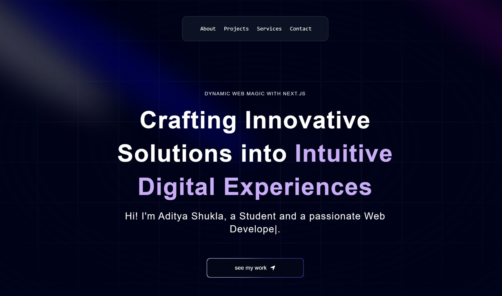

   
      
   

  

    
    
    
    
  

  <h3 align="center">Aditya Shukla's Portfolio</h3>

## 📋 <a name="table">Table of Contents</a>

1. 🤖 [Introduction](#introduction)
2. ⚙️ [Skills](#skills)
3. 🔋 [Projects](#features)
4. 🤸 [Contact Me](#quick-start)
5. 🕸️ [Download CV](#snippets)

## <a name="introduction">🤖 Introduction</a>

B.Tech Information Technology student in 3rd year, enthusiastic about securing an internship opportunity.

## <a name="skills">⚙️ Skills</a>

- Java
- Python
- MySQL
- MERN

## <a name="features">🔋Small selection of my Projects</a>

👉 **Havenly Homes**

- Dynamic real estate platform powered by MERN stack technology.
- 

    
<code>Details</code>

  - ⚙️ Tech Stack - MongoDB, Express, React, Nodejs and Tailwind
  - 🔗 Link - [Project link](https://havenlyhomes.onrender.com/)

    

   

👉 **Weather Site**

- Real-time weather updates and forecasts for global locations.
- 

    
<code>Details</code>

  - ⚙️ Tech Stack - HTML, CSS, Javascript
  - 🔗 Link - [Project link](https://weather-site-aditya.netlify.app/)

    

   

👉 **Rock Paper Scissors Game**

- Engage in classic showdowns with rock, paper, scissors online.

- 

    
<code>Details</code>

  - ⚙️ Tech Stack - HTML, CSS, Javascript
  - 🔗 Link - [Project link](https://aditya10403.github.io/RockPaperScissor/)

  

## <a name="quick-start">🤸 Contact Me</a>

- **Email**: [adityashukla2021@gmail.com](mailto:adityashukla2021@gmail.com)
- **LinkedIn**: [Aditya Shukla](https://www.linkedin.com/in/aditya-shukla-637636256/)

## <a name="snippets">🚀 Resume</a>

- [Download Resume](/public/Resume.pdf)

#
